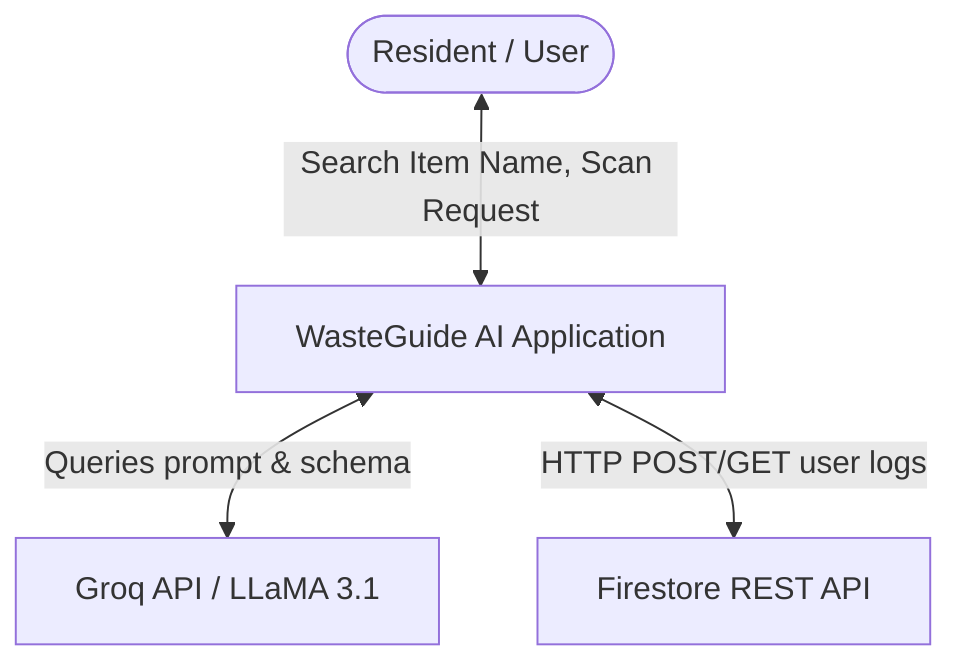
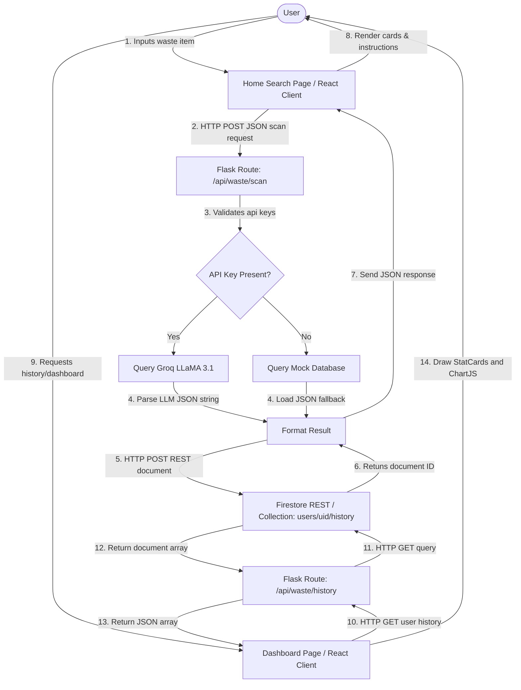

# Data Flow Diagram (DFD)

This document diagrams the movement of information within the **WasteGuide AI** ecosystem, spanning the React client, Flask backend, Firestore REST endpoint, and Groq API.

---

## 1. DFD Level 0 (Context Diagram)

The Context Diagram defines the external boundaries of the WasteGuide AI application:

---

## 2. DFD Level 1 (Process Breakdown)

The Level 1 Diagram decomposes the internal operations of the frontend client and backend routes:

---

## 3. Data Store Definitions

*   **`Store 1: Local History JSON Fallback`**: Used in local-offline situations. A JSON file (`backend/data/history.json`) storing user logs.
*   **`Store 2: Cloud Firestore Database`**: High-availability document collection organized by user ID (`users/{uid}/history/{doc_id}`). Holds item name, classification details, recyclable flag, and timestamp.
*   **`Store 3: Collection Centers Database`**: Mock geographical location index storing coordinate arrays, phone numbers, and operational hours.
