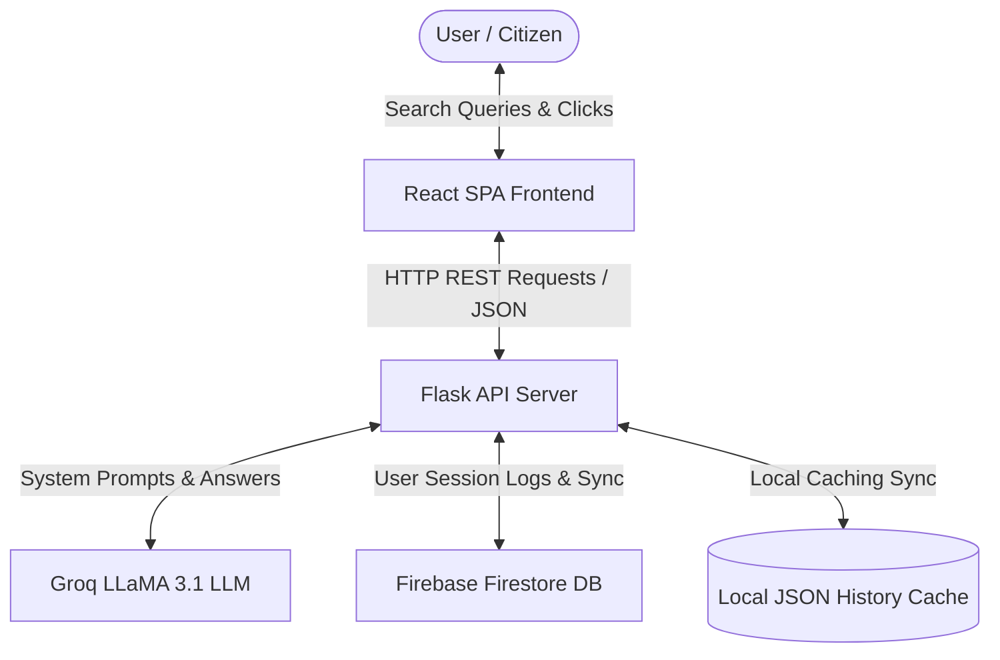
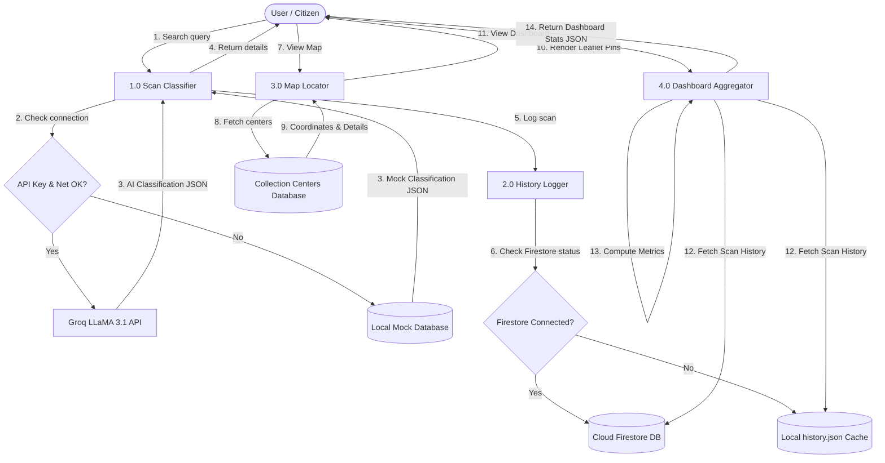

# Milestone 2: Requirement Analysis

This folder contains the requirements definitions, customer journey maps, data flow specifications, and tech stack details for **WasteGuide AI**.

---

## 🗺️ 1. Customer Journey Map

We mapped our user's journey across five key stages to ensure we optimize their experience when interacting with the application:

| CJM Stage | Actions / Steps | Touchpoints | User Thoughts | Emotions | Pain Points | Opportunities |
| :--- | :--- | :--- | :--- | :---: | :--- | :--- |
| **1. Discovery** | Hears about WasteGuide AI from a municipal flyer or eco-blog. | Flyer, Web Search | *"Can an AI actually tell me where my trash goes?"* | 🤔 | Doesn't know if the app supports local city rules. | Prominently display local geolocated recycling centers. |
| **2. Onboarding** | Opens web portal on mobile, views terminal UI, and logs in. | Mobile Browser, Login Screen | *"This dark green console look is cool! Let's scan."* | 😄 | Hesitancy to create another account. | Initialize a quick auto-login guest session (`demo-user`). |
| **3. Scanning** | Searches for "greasy pizza box" or clicks "led bulb". | AI search console, ResultCard | *"Ah, greasy cardboard isn't recyclable. Good to know!"* | 💡 | Slow load times when querying external APIs. | Incorporate real-time typing console logs to keep user engaged. |
| **4. Map Routing** | Filters centers by "E-Waste" to find where to dispose of LED bulbs. | Leaflet map, Center listings | *"GreenEarth is only 1.2 miles away! Let's go."* | 🗺️ | Hard to get directions on other maps. | Embed direct Google Maps GPS navigation external links. |
| **5. Reflection** | Reviews dashboard to see weekly stats and recycling rate. | Stats Dashboard, Charts | *"I recycled 80% of my items this week! Awesome."* | 🎉 | Charts can be dry and hard to read. | Use interactive Chart.js line and doughnut charts with bright hover states. |

---

## 📊 2. Data Flow Diagrams (DFD)

WasteGuide AI handles data flow across the client browser, the Flask server, the Groq LLaMA models, and the database storage options.

### Level 0: Context Diagram

### Level 1: Process Flow Diagram

---

## 📋 3. Solution Requirements

### Functional Requirements (FR)
| ID | Requirement Name | Description & Specification | Priority |
| :---: | :--- | :--- | :---: |
| **FR-1** | User Session Management | The system must establish a unique session context (`X-User-Id` header) to assign scan histories to individual users, falling back to a guest tenant (`demo-user`) if offline. | High |
| **FR-2** | AI Waste Classifier | The scanner must accept natural language search strings, process them through LLaMA-3.1, and return structured waste properties (recyclability, steps, warnings). | High |
| **FR-3** | Resilient Caching Fallback | In the absence of an internet connection or active API keys, the server must automatically redirect queries to a local JSON cache and mock database without throwing exceptions. | High |
| **FR-4** | Interactive Map Geolocation | The interface must display local recycling centers on a map using Leaflet, allowing the user to filter centers by accepted waste categories. | Medium |
| **FR-5** | External Map Navigation | The map details pane must provide hyperlinked routing paths that open Google Maps with coordinates preloaded for easy citizen navigation. | Medium |
| **FR-6** | Aggregated Dashboard Stats | The backend must aggregate total scans, recycling rates, category distributions, and activity timelines for dynamic graphing on the frontend. | Medium |

### Non-Functional Requirements (NFR)
| ID | NFR Category | Target Metric / Acceptance Criteria |
| :---: | :--- | :--- |
| **NFR-1** | Performance & Speed | Live LLaMA 3.1 AI scanning response latency must not exceed **2.5 seconds** under typical network loads. |
| **NFR-2** | Fail-Safe Latency | File-based local mock database scanner latency must not exceed **15 milliseconds**. |
| **NFR-3** | Availability & Reliability | The local database caching adapter must ensure **100% availability** for classification searches, history writes, and map requests during cloud outages. |
| **NFR-4** | Accessibility & Responsiveness | The visual terminal interface must comply with **WCAG 2.1 AA** color contrast and render fluidly across standard mobile viewports (minimum width: 320px). |
| **NFR-5** | Security & Credentials | Sensitive configurations (Groq key, Firebase endpoints) must remain strictly on the backend, managed via `.env` variables, and never exposed in client bundles. |

---

## 🛠️ 4. Technology Stack

We selected a lightweight, decoupled web architecture to maximize performance, deployment ease, and fail-safe robustness:

| Component / Layer | Technology Used | Description | Reason for Choice |
| :--- | :--- | :--- | :--- |
| **Frontend UI** | **React 19** | Single Page Application framework. | Exceptional performance, components reuse, and native support for modern hooks. |
| **Styling System** | **Tailwind CSS** | Utility-first CSS library. | Allows rapid implementation of a custom green terminal palette and retro neon design. |
| **Mapping Engine** | **React Leaflet** | Mobile-friendly interactive mapping client. | Open-source, does not require Google Maps API billing, and integrates seamlessly with OpenStreetMap. |
| **Backend API** | **Flask (Python 3.12)** | Lightweight Python WSGI micro-framework. | Minimal boilerplate, quick endpoint registration, and native integration with the Python Groq SDK. |
| **AI LLM Engine** | **Groq LLaMA 3.1** | `llama-3.1-8b-instant` hosted inference. | Extreme inference speeds (tokens/sec) enabling real-time waste scans in under 1.5 seconds. |
| **Cloud Database** | **Firebase Firestore** | NoSQL document database accessed via REST API. | Easy collection structures, does not require complex Admin SDK keys, and fits standard JSON payloads perfectly. |
| **Local Cache** | **JSON Flat File** | Flat file JSON registry (`history.json`). | Lightweight, zero-config, highly portable, and ensures complete offline operational robustness. |
