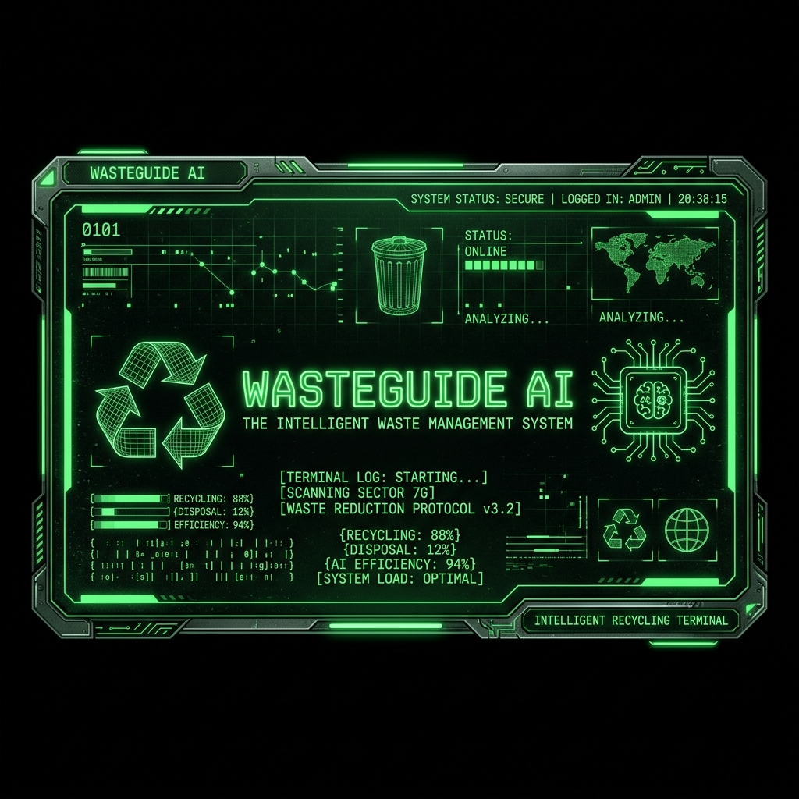

# WasteGuide AI: Intelligent Real-Time Waste Classifier and Geolocation Assistant

<p align="center">
  
</p>

<p align="center">
  
  
  
  
</p>

---

## 📖 1. Project Overview
**WasteGuide AI** is an intelligent, real-time waste classification and geolocation web portal styled with a high-fidelity dark terminal theme. Designed as the capstone project for the **SmartBridge AI Specialist Track**, the application solves the recycling educational gap by utilizing generative AI and dynamic mapping to help citizens make correct sorting decisions at the point of disposal.

By integrating **Groq LLaMA 3.1 LLM** for text analysis, **React Leaflet** for geolocation mapping of local recycling hubs, and **Firebase Firestore REST API** for sync log tracking, WasteGuide AI delivers a seamless, zero-install, and highly resilient system. It features a fail-safe offline database caching system to ensure 100% operation rate even when network connections drop.

---

## 🛠️ 2. Core Problem & Solution

### The Problem
*   **Curbside Contamination**: Sorting errors at the bin level introduce food-soiled cardboard or single-use plastics into clean streams, ruining recyclable batches and sending tons of waste to landfills.
*   **"Wishcycling"**: Well-intentioned users throw hazardous components (lithium battery packs, LED bulbs) into common recycle bins, creating fire risks and environmental contamination.
*   **Access Barriers**: Municipal guidelines are complex, dry, and lack dynamic routing to specialized recycling centers that accept items not fit for curbside pickup.

### The Solution
*   **Real-Time AI Waste Classifier**: Instant search for any waste material returns safety rules, cleaning instructions, and upcycling tips in under 2.5 seconds.
*   **Safety Warning System**: High-alert red pulsing banners flag hazardous e-waste or chemicals, preventing toxic ground leaching.
*   **Interactive Geolocation Map**: Dynamically locates the nearest specialized recycling facilities with distance calculations and Google Maps routing.
*   **Personal Stats Dashboard**: Aggregates history data into visual terminal-style metrics (recycling success rates, category breakdowns) to gamify user recycling habits.
*   **Fail-Safe Architecture**: Gracefully switches to local JSON database caching if cloud or internet connections drop.

---

## 🧭 3. Repository Directory Roadmap

This repository is structured sequentially following the capstone milestone stages. Click any link below to explore the phase details:

| Folder / Milestone Phase | Description & Key Deliverables |
| :--- | :--- |
| 📁 [1. Brainstorming & Ideation](file:///c:/Users/Sameer/OneDrive/Desktop/WasteManagement/1.%20Brainstorming%20&%20Ideation/README.md) | Features ideation lists, feasibility rankings, problem definitions, and empathy maps. |
| 📁 [2. Requirement Analysis](file:///c:/Users/Sameer/OneDrive/Desktop/WasteManagement/2.%20Requirement%20Analysis/README.md) | Mapped Customer Journey Maps, Level 0 & 1 Data Flow Diagrams (DFD), and Solution Requirements. |
| 📁 [3. Project Design Phase](file:///c:/Users/Sameer/OneDrive/Desktop/WasteManagement/3.%20Project%20Design%20Phase/README.md) | Lean Problem-Solution Fit Canvas, proposed architecture, and system database schemas. |
| 📁 [4. Project Planning Phase](file:///c:/Users/Sameer/OneDrive/Desktop/WasteManagement/4.%20Project%20Planning%20Phase/README.md) | Project WBS, scheduling Gantt chart, and task allocations. |
| 📁 [5. Project Development Phase](file:///c:/Users/Sameer/OneDrive/Desktop/WasteManagement/5.%20Project%20Development%20Phase/README.md) | Completed React/Flask source code layout, AI prompts catalog, and developer workflow guidelines. |
| 📁 [6. Performance Testing](file:///c:/Users/Sameer/OneDrive/Desktop/WasteManagement/6.%20Performance%20Testing/README.md) | Latency statistics, API response speeds, and complete User Acceptance Testing (UAT) checks. |
| 📁 [7. Documentation & Demo](file:///c:/Users/Sameer/OneDrive/Desktop/WasteManagement/7.%20Documentation%20&%20Demo/) | Contains the PDF guides (Execution Guide and Final Project Report) outside the codebase. |
| 📁 [src](file:///c:/Users/Sameer/OneDrive/Desktop/WasteManagement/src/) | Contains the active project codebase (frontend React SPA and backend Flask API). |
| 📁 [8. Project Demonstration](file:///c:/Users/Sameer/OneDrive/Desktop/WasteManagement/8.%20Project%20Demonstration/README.md) | Final scalability blueprints, team delegation charts, and evaluation run scripts. |

---

## ⚙️ 4. Quick Start & Execution

Follow the instructions below to configure and run the application locally.

### Prerequisites
*   **Python 3.12+**
*   **Node.js 18+**
*   **Groq API Key** (obtain from [Groq Console](https://console.groq.com/))
*   *(Optional)* **Firebase Project API Key** for real-time cloud Firestore logging.

### Backend Setup
1. Navigate to the backend directory:
   ```bash
   cd "src/backend"
   ```
2. Create and activate a virtual environment:
   ```bash
   python -m venv venv
   # On Windows:
   venv\Scripts\activate
   # On macOS/Linux:
   source venv/bin/activate
   ```
3. Install dependencies:
   ```bash
   pip install -r requirements.txt
   ```
4. Copy `.env.example` to `.env` and fill in your keys:
   ```env
   GROQ_API_KEY=gsk_your_groq_api_key_here
   FIREBASE_PROJECT_ID=your_firebase_project_id
   FIREBASE_API_KEY=your_firebase_api_key
   ```
5. Run the server:
   ```bash
   python app.py
   ```

### Frontend Setup
1. Open a new terminal and navigate to the frontend directory:
   ```bash
   cd "src/frontend"
   ```
2. Install Node packages:
   ```bash
   npm install
   ```
3. Run the development server:
   ```bash
   npm run dev
   ```
4. Open your browser and navigate to `http://localhost:5173`.

---

## 🎨 5. User Interface & Demonstration

For visual documentation, cropped UI screengrabs, and layout metrics, check [SCREENSHOTS.md](file:///c:/Users/Sameer/OneDrive/Desktop/WasteManagement/docs/SCREENSHOTS.md). All captures are stored under the [Screenshots/](file:///c:/Users/Sameer/OneDrive/Desktop/WasteManagement/Screenshots/) folder.

---

## 🎓 6. Submission Metadata
*   **Student Name**: Sameer
*   **Academic Partner**: SmartBridge Academy
*   **Specialist Track**: AI Specialist Track
*   **Team ID**: shaikzz-collab
*   **Deliverables**: The PDF guides (Execution Guide and Project Report) are located inside [7. Documentation & Demo](file:///c:/Users/Sameer/OneDrive/Desktop/WasteManagement/7.%20Documentation%20&%20Demo/).
